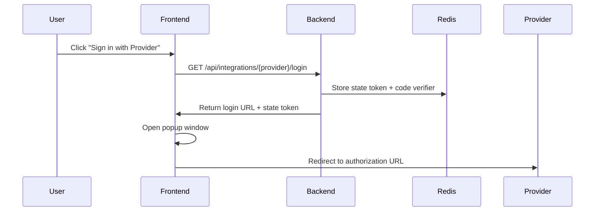
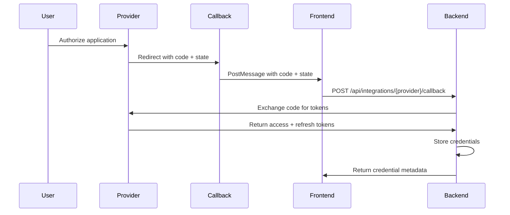
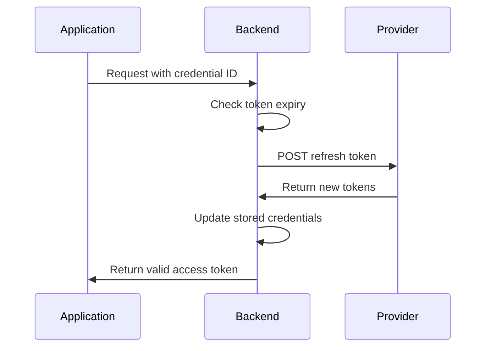
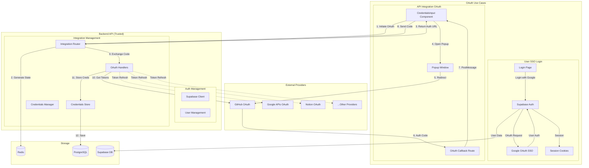
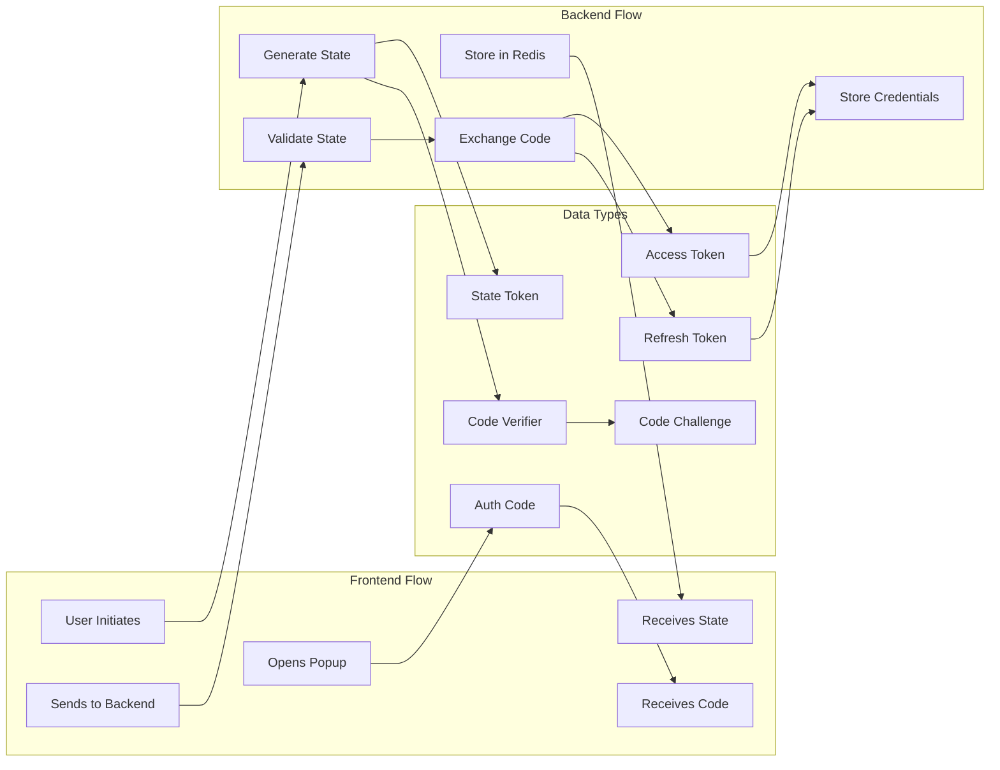
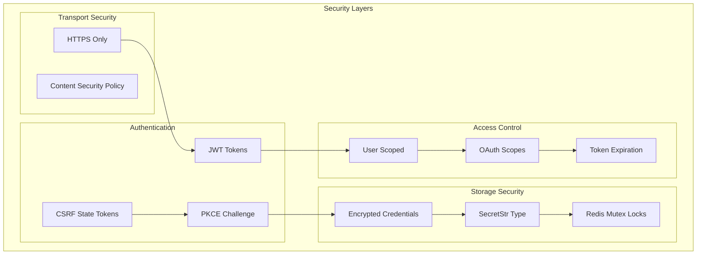
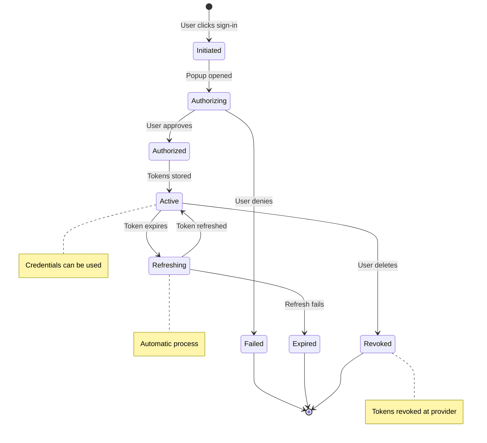

# OAuth 集成流程文档

## 概述

AutoGPT 平台在两种不同场景下实现 OAuth 2.0：

1. **用户认证（SSO）**：由 Supabase 处理平台登录
2. **API 集成凭据**：用于第三方服务访问的自定义 OAuth 实现

本文档重点介绍用于连接外部服务的 **API 集成 OAuth 流程**。有关支持的提供商列表，请参阅 `/backend/backend/integrations/providers.py`。有关用户认证文档，请参阅 Supabase 认证实现。

## 信任边界

### 1. 前端信任边界

- **位置**：浏览器/客户端应用程序
- **组件**：
  - `CredentialsInput` 组件 (`/frontend/src/components/integrations/credentials-input.tsx`)
  - OAuth 回调路由 (`/frontend/src/app/(platform)/auth/integrations/oauth_callback/route.ts`)
- **信任级别**：不可信 - 用户控制的环境
- **安全措施**：
  - 通过状态令牌进行 CSRF 保护
  - 基于弹出窗口的流程以防止 URL 暴露
  - 跨窗口通信的消息验证

### 2. 后端 API 信任边界

- **位置**: 服务端 FastAPI 应用
- **组件**:
  - 集成路由器 (`/backend/backend/server/integrations/router.py`)
  - OAuth 处理器 (`/backend/backend/integrations/oauth/`)
  - 凭据存储 (`/backend/backend/integrations/credentials_store.py`)
- **信任级别**: 受信任 - 服务器控制环境
- **安全措施**:
  - 基于 JWT 的身份验证
  - 加密凭据存储
  - 令牌刷新处理
  - 作用域验证

### 3. 外部提供商信任边界

- **位置**: 第三方 OAuth 提供商
- **组件**: 提供商授权端点
- **信任级别**: 半信任 - 外部服务
- **安全措施**:
  - 仅限 HTTPS 通信
  - 提供商特定的安全功能
  - 令牌撤销支持

## 组件架构

### 前端组件

#### 1. CredentialsInput 组件

- **用途**: 用于凭据选择和 OAuth 启动的 UI 组件
- **关键功能**:
  - 显示可用凭据
  - 通过弹出窗口启动 OAuth 流程
  - 处理 OAuth 回调消息
  - 管理凭据选择状态

#### 2. OAuth 回调路由

- **路径**: `/auth/integrations/oauth_callback`
- **用途**: 接收来自提供商的 OAuth 授权码
- **流程**:
  1. 从提供商接收 `code` 和 `state` 参数
  2. 向父窗口发送包含结果的消息
  3. 自动关闭弹出窗口

### 后端组件

#### 1. 集成路由器

- **基础路径**: `/api/integrations`
- **关键端点**:
  - `GET /{provider}/login` - 启动 OAuth 流程
  - `POST /{provider}/callback` - 将授权码交换为令牌
  - `GET /credentials` - 列出用户凭据
  - `DELETE /{provider}/credentials/{id}` - 撤销凭据

#### 2. OAuth 基础处理器

- **用途**: 用于特定提供商的 OAuth 实现的抽象基类
- **关键方法**:
  - `get_login_url()` - 构建提供商授权 URL
  - `exchange_code_for_tokens()` - 将授权码交换为访问令牌
  - `refresh_tokens()` - 刷新过期的访问令牌
  - `revoke_tokens()` - 在提供商处撤销令牌

#### 3. 凭据存储

- **用途**: 管理凭据持久化和状态
- **关键特性**:
  - 基于 Redis 的互斥锁用于并发访问控制
  - OAuth 状态令牌生成和验证
  - 支持 PKCE 及代码挑战生成
  - 默认系统凭据注入

## OAuth 流程序列

### 1. 流程启动



### 2. 授权



### 3. 令牌刷新



## 系统架构图



## 数据流图



## 安全架构



## 凭据生命周期



## OAuth 类型比较

### 通过 Supabase 的用户认证 (SSO)

- **用途**：验证用户身份以访问 AutoGPT 平台
- **提供商**：Supabase Auth（当前支持 Google 单点登录）
- **流程路径**：`/login` → Supabase OAuth → `/auth/callback`
- **会话存储**：Supabase 托管的 cookies
- **令牌管理**：由 Supabase 自动处理
- **用户体验**：平台单点登录

### API 集成凭据

- **用途**：授予 AutoGPT 访问用户第三方服务的权限
- **提供商**：示例包括 GitHub、Google APIs、Notion 等
  - 完整列表位于 `/backend/backend/integrations/providers.py`
  - OAuth 处理程序位于 `/backend/backend/integrations/oauth/`
- **流程路径**：集成设置 → `/api/integrations/{provider}/login` → `/auth/integrations/oauth_callback`
- **凭据存储**：在 PostgreSQL 中加密存储
- **令牌管理**：使用互斥锁的自定义刷新逻辑
- **用户体验**：连接外部服务以在工作流中使用

## 数据流与安全

### 1. 状态令牌流程

- **生成**：使用 `secrets.token_urlsafe()` 生成随机 32 字节令牌
- **存储**：Redis 存储，10 分钟过期
- **验证**：使用 `secrets.compare_digest()` 进行恒定时间比较
- **目的**：CSRF 保护和请求关联

### 2. PKCE 实现

- **代码验证器 (Code Verifier)**: 使用 `secrets.token_urlsafe(128)` 生成的随机字符串（base64url 编码后约 171 个字符，但 RFC 7636 建议 43-128 个字符）
- **代码挑战 (Code Challenge)**: 验证器的 SHA256 哈希值，经 base64url 编码
- **存储**: 与状态令牌一同存入数据库（加密），有效期为 10 分钟
- **用途**: 增强公共客户端的安全性（目前由 Twitter 提供商使用）

### 3. 凭证存储

- **结构**:

  ```python
  OAuth2Credentials:
    - id: UUID
    - provider: ProviderName
    - access_token: SecretStr (encrypted)
    - refresh_token: Optional[SecretStr]
    - scopes: List[str]
    - expires_at: Optional[int]
    - username: Optional[str]
  ```

- **持久化**: 通过 Prisma ORM 存入 PostgreSQL
- **访问控制**: 用户作用域，带互斥锁

### 4. 令牌安全

- **存储**: 令牌以 `SecretStr` 类型存储
- **传输**: 仅限 HTTPS，绝不记录日志
- **刷新**: 到期前 5 分钟自动刷新
- **撤销**: 支持已实现该功能的提供商

## 提供商实现

### 支持的提供商

该平台支持多种 OAuth 提供商，包括 GitHub、Google、Notion、Twitter 等。完整列表请参见：

- `/backend/backend/integrations/providers.py` - 所有支持的提供商
- `/backend/backend/integrations/oauth/` - OAuth 实现

### 特定提供商的安全注意事项

- **GitHub**: 支持可选令牌过期 - 默认情况下令牌可能永不过期
- **Linear**: 将作用域作为空格分隔字符串返回，需要特殊解析
- **Google**: 需要显式离线访问作用域才能获取刷新令牌
- **Twitter**: 使用 PKCE 增强公共客户端的安全性

每个提供商处理程序都实现了 `BaseOAuthHandler` 中定义的安全措施，确保所有集成中的令牌管理和刷新逻辑保持一致。

## 安全最佳实践

### 1. 前端安全

- 使用弹出窗口防止 URL 篡改
- 在处理回调前验证状态令牌
- 从窗口消息中清除敏感数据
- 为 OAuth 流程实施超时机制（5分钟）

### 2. 后端安全

- 将客户端密钥存储在环境变量中
- 对所有 OAuth 端点使用 HTTPS
- 实施适当的作用域验证
- 记录安全事件但不暴露令牌
- 使用数据库事务进行凭据更新

### 3. 令牌管理

- 主动刷新令牌（到期前5分钟）
- 删除凭据时撤销令牌
- 绝不在日志或错误消息中暴露令牌
- 使用恒定时间比较进行令牌验证

## 错误处理

### 常见错误场景

1. **无效状态令牌**: 400 错误请求
2. **提供程序配置缺失**: 501 未实现
3. **令牌交换失败**: 400 错误请求（含提示信息）
4. **Webhook 冲突**: 409 冲突，需要确认
5. **凭据未找到**: 404 未找到

### 错误响应格式

```json
{
  "detail": {
    "message": "Human-readable error description",
    "hint": "Actionable suggestion for resolution"
  }
}
```

## 测试注意事项

### 单元测试

- 模拟 OAuth 提供程序进行流程测试
- 测试状态令牌生成和验证
- 验证 PKCE 实现
- 测试并发访问场景

### 集成测试

- 优先使用提供程序的沙盒环境
- 与真实提供程序测试完整 OAuth 流程
- 验证令牌刷新机制
- 测试错误场景和恢复流程

### 日志记录指南

- 记录流程启动和完成
- 记录带上下文信息的错误（不含令牌）
- 跟踪提供程序特定问题
- 监控可疑模式